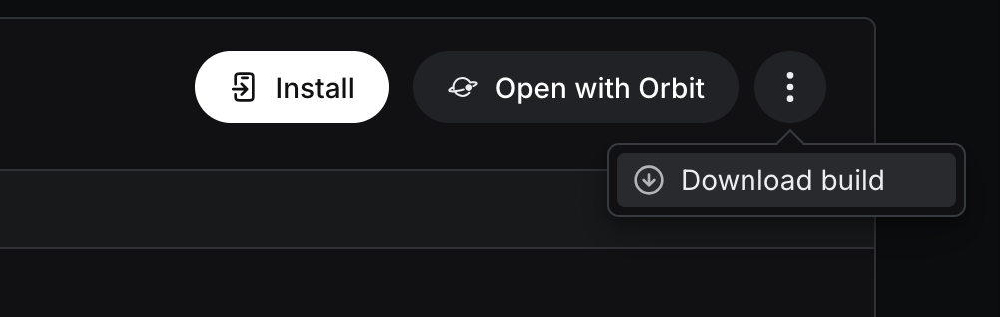

# List Challenge — React Native

Aplicación móvil desarrollada como parte de un proceso de selección para Desarrollador React Native.

## Acceso rápido

**APK Android (sin instalar nada adicional):**
[Descargar APK](https://expo.dev/accounts/diegoasders/projects/list-challenge/builds/90f9ddb3-365f-4ab2-8a5b-fcc3c540b547)



**Usuario demo:**
- Email: `demo@challenge.com`
- Contraseña: `demo1234`

---

## Levantar el proyecto localmente

### Requisitos
- Node.js >= 18
- Expo Go instalado en el dispositivo ([iOS](https://apps.apple.com/app/expo-go/id982107779) / [Android](https://play.google.com/store/apps/details?id=host.exp.exponent))

### Instalación

```bash
git clone https://github.com/dplazagarrido/list-challenge.git
cd list-challenge
npm install --legacy-peer-deps
npx expo start
```

Escanear el QR con Expo Go.

---

## Decisiones técnicas

### Stack

| Herramienta | Justificación |
|---|---|
| Expo managed workflow | Permite distribuir la app sin compilación nativa local, cumpliendo el requisito de versión ejecutable sin levantar entorno local. El APK fue generado con EAS Build en los servidores de Expo. |
| Redux Toolkit | Estándar de la industria para manejo de estado predecible. |
| React Navigation | Solución oficial y más mantenida para navegación en React Native. |
| Axios | Familiaridad y consistencia.
| TypeScript | Tipado estricto en la app, incluyendo el store de Redux, hooks personalizados y servicios. |

### Manejo de sesión y autenticación

La autenticación es simulada mediante una función que retarda 800ms y valida credenciales hardcodeadas, retornando un token mock. Este token se persiste en **AsyncStorage** para restaurar la sesión al reabrir la app.

El navigator (`AppNavigator`) lee el estado de autenticación desde Redux — cuando `isAuthenticated` cambia, React Navigation redirige automáticamente sin necesidad de navegación imperativa.

> **Nota de seguridad:** En producción, el token debería almacenarse 
> usando el Keychain de iOS o Keystore de Android — accesibles mediante 
> librerías como `react-native-keychain` o `Expo SecureStore` — ya que 
> AsyncStorage guarda datos en texto plano. Se usó AsyncStorage dado que 
> el token es simulado y no contiene información sensible real.

### Estrategia para renderizar la lista

[PokéAPI](https://pokeapi.co/) no cuenta con un único endpoint que devuelva 2000+ elementos. Para cumplir el requisito se combinaron tres endpoints en paralelo:

```
/pokemon  → ~1350 elementos
/move     →  ~920 elementos
/item     →  ~700 elementos
─────────────────────────────
Total     → ~2970 elementos
```

Las tres requests se ejecutan simultáneamente con `Promise.all` para minimizar el tiempo de carga inicial.

Para el renderizado eficiente de ~2970 elementos se usó `FlatList` con las siguientes optimizaciones:

- **`getItemLayout`**: informa a FlatList la altura exacta de cada item (49px fijos), eliminando la necesidad de medición dinámica
- **`windowSize={10}`**: renderiza solo los items visibles más un buffer de 5 viewports arriba y abajo
- **`maxToRenderPerBatch={20}`**: limita los items renderizados por frame para no bloquear el hilo principal
- **`initialNumToRender={20}`**: renderiza solo los primeros 20 items en el mount inicial
- **`removeClippedSubviews={true}`**: desmonta los items fuera del viewport en Android
- **`memo()`** en `PokeListItem`: evita re-renders del item cuando el estado global cambia
- **`useCallback`** en `renderItem` y `keyExtractor`: evita nuevas referencias en cada render del padre
- **`useMemo`** en el filtrado por búsqueda: el cálculo solo se ejecuta cuando cambia la query o los datos

La virtualización fue verificada con React Native DevTools — al montar la lista se renderizan ~75 items de 2970, ajustado por `windowSize` y `maxToRenderPerBatch` para balancear performance y experiencia de scroll.

### Variables de entorno

Las URLs de la API están centralizadas en `constants/config.ts` con separación dev/prod. En un proyecto real se usaría `expo-constants` con `app.config.ts` para inyectar variables según el entorno de build.

---

## Tests

```bash
npx jest
```

Cobertura actual: **14 tests** distribuidos en:

- `authSlice` — 5 tests: estado inicial, loginStart, loginSuccess, loginFailure, logout
- `pokeSlice` — 5 tests: estado inicial, fetchStart, fetchSuccess, fetchFailure, tipos correctos
- `pokeApi` — 4 tests: combinación de endpoints, tipos asignados, URLs correctas, propagación de errores

Los tests de servicio mockean Axios para verificar que los 3 endpoints se llaman correctamente y que los tipos se asignan bien a cada item.

---

## Posibles mejoras y siguientes pasos

- **Detalle de item**: navegar a una pantalla de detalle al tocar un elemento
- **Paginación progresiva**: cargar los datos por páginas con infinite scroll en lugar de una sola request grande
- **Offline support**: cachear los datos con AsyncStorage para uso sin conexión
- **Blank flash**: el parpadeo ocasional al hacer scroll muy rápido es un trade-off conocido de la virtualización en RN — se puede reducir aumentando `windowSize` a costa de mayor uso de memoria
- **FlashList**: Para listas con items más complejos (imágenes, animaciones, 
layouts pesados) o en dispositivos Android de gama baja, migrar a FlashList 
de Shopify sería una mejora significativa. Para este caso, con items simples 
de altura fija y buen rendimiento verificado en iOS y Android, FlatList 
correctamente configurada fue suficiente.
- **Design system externo**: para mayor escala considerar Tamagui o RN Paper

---

## Estructura del proyecto

```
src/
├── components/       # Componentes reutilizables (PokeListItem)
├── constants/        # Tema visual y configuración de entorno
├── hooks/            # Hooks tipados para Redux y fetching
├── navigation/       # AppNavigator con auth flow
├── screens/          # LoginScreen, HomeScreen
├── services/         # Lógica de fetching (pokeApi.ts)
├── store/
│   └── slices/       # authSlice, pokeSlice
└── types/            # Interfaces y tipos globales
```